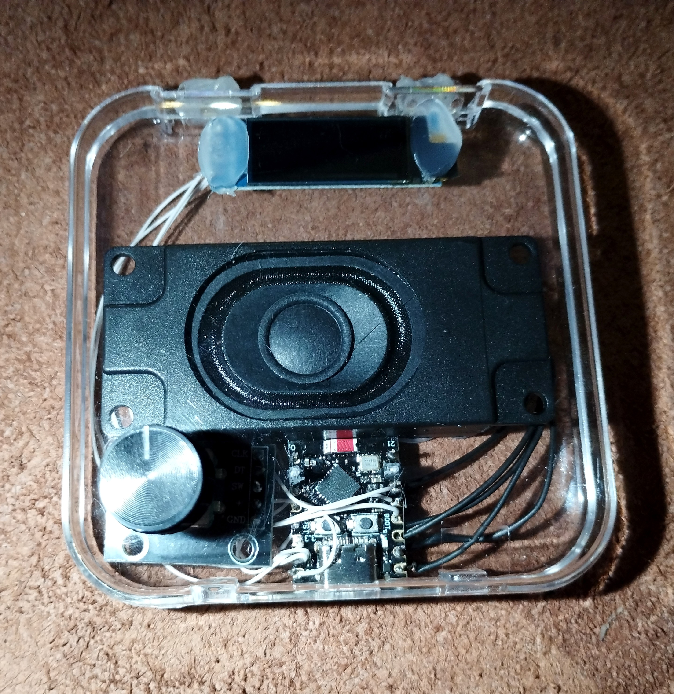
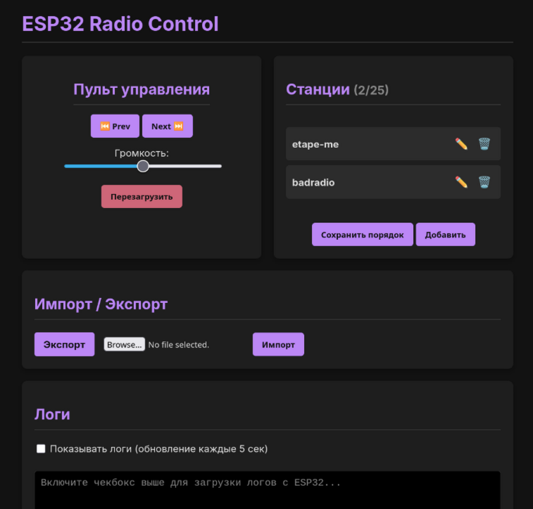
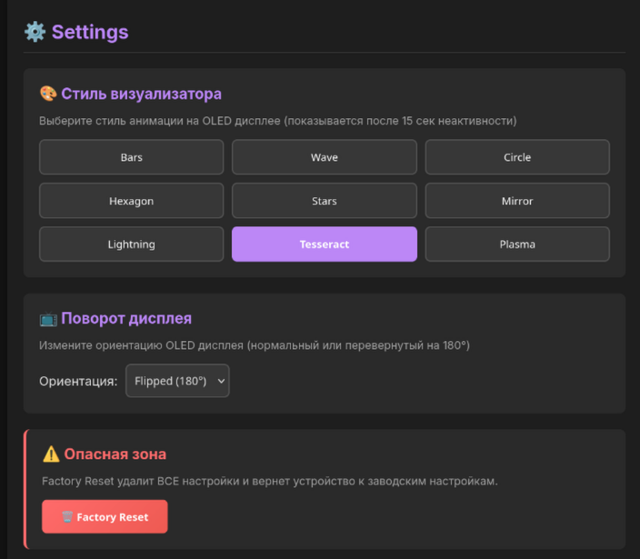
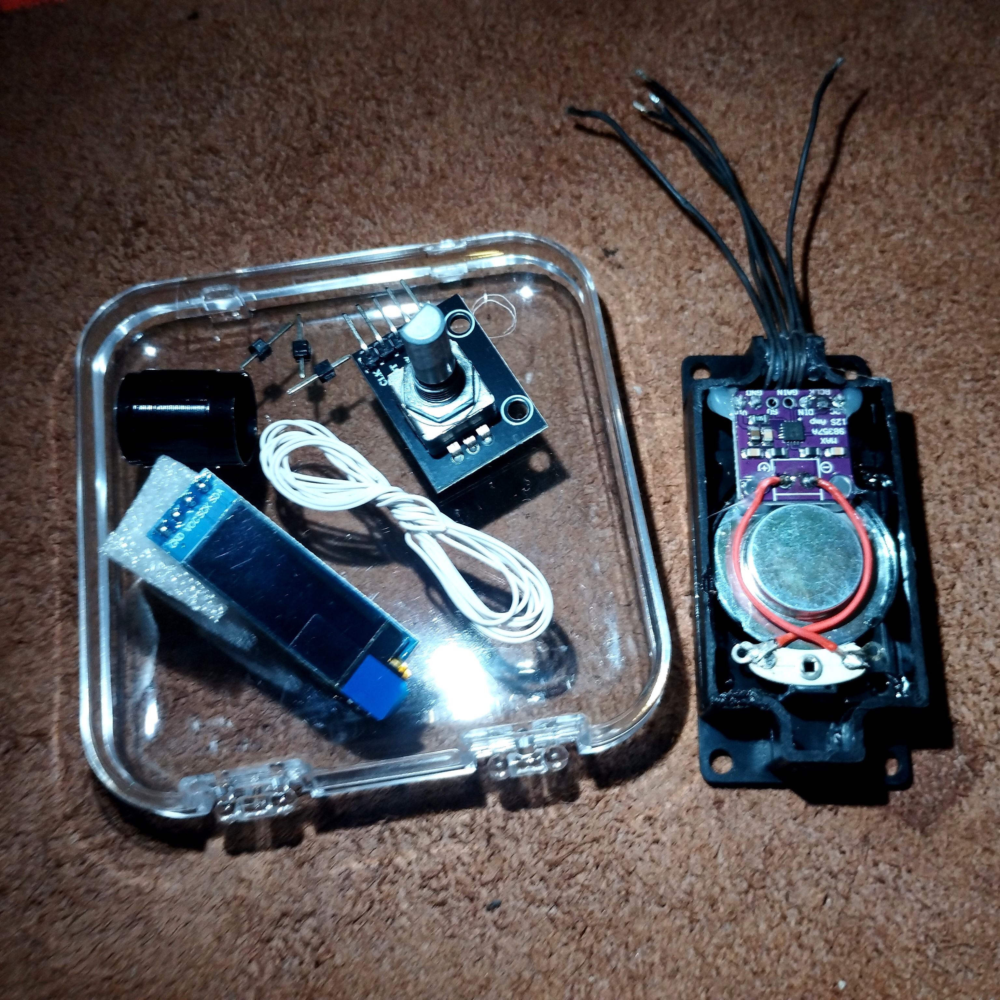
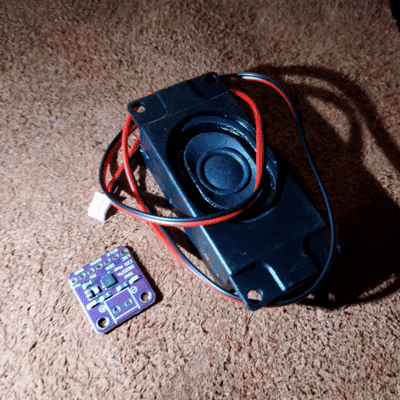
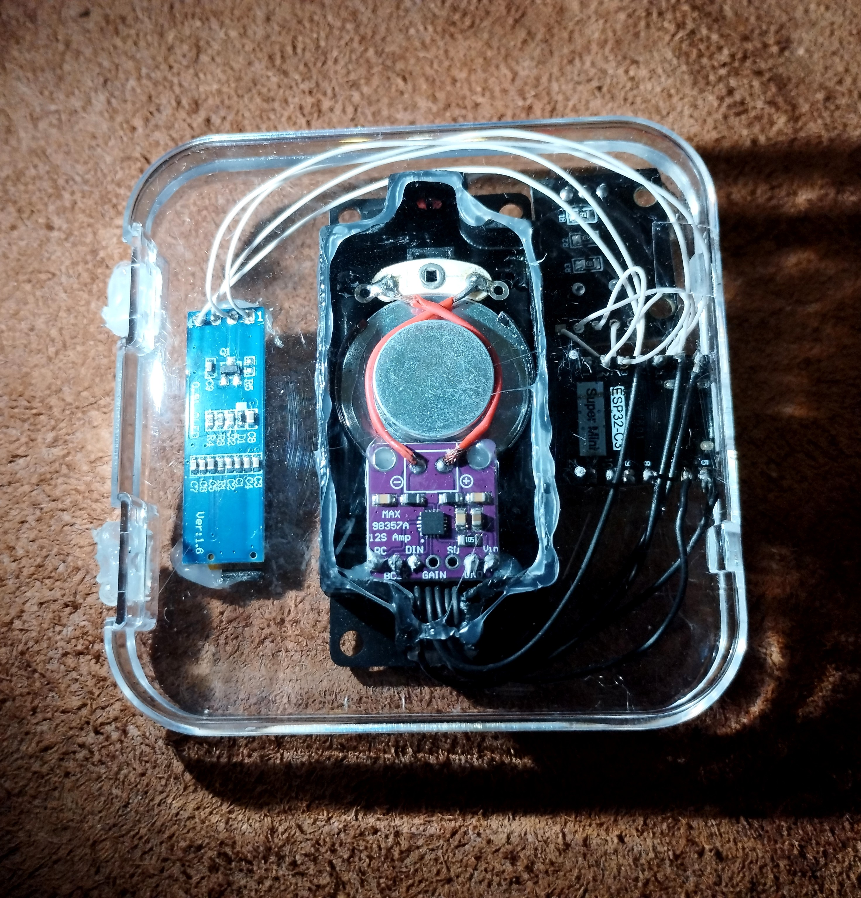
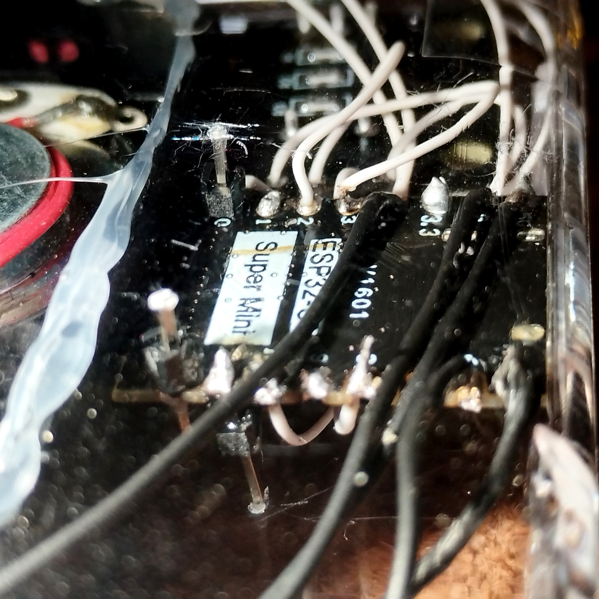
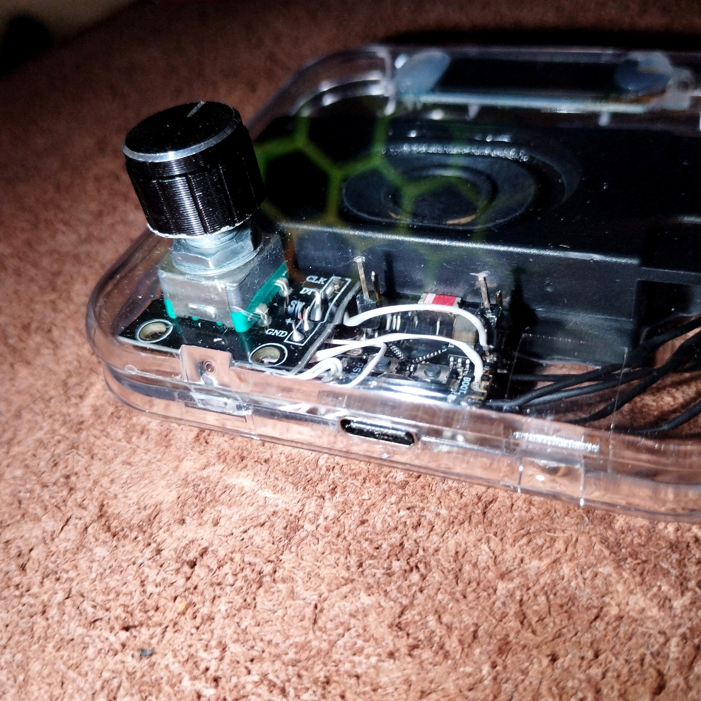

# 📻 ESP32-C3 Internet Radio v4.5

<div align="center">


*Professional ESP32-C3 Internet Radio with OLED Display and Visualizer*

[](https://opensource.org/licenses/MIT)
[](https://platformio.org/)
[](https://www.espressif.com/en/products/socs/esp32-c3)

**Advanced internet radio** with web interface, 9 real-time audio visualizers, and smart power management

[✨ Features](#-key-features) • [🚀 Quick Start](#-installation-and-flashing) • [📸 Gallery](#-gallery) • [🛠️ Build Guide](#-wiring-diagram)

</div>

---

## ✨ Key Features

🎵 **Audio Streaming**
- High-quality MP3 streaming (up to 320 kbps)
- Large 128KB buffer for smooth playback on weak WiFi
- Up to 25 radio stations with instant switching
- 32-level volume control with smooth transitions

🎨 **Visual Experience**
- 0.91" OLED display (128×32) with 9 visualization modes
- Real-time audio spectrum analyzer
- Station info, time, and network status display
- Auto-dimming for power saving

🌐 **Web Interface**
- Modern responsive web UI accessible from any device
- Station management (add/edit/delete/reorder)
- Real-time system monitoring and WiFi diagnostics
- Complete configuration without reflashing

🔧 **Hardware Control**
- Rotary encoder (KY-040) for volume and station selection
- Single click → next station
- Double click → previous station
- Long press (5s) → power off

⚡ **Smart Features**
- Automatic WiFi reconnection with signal monitoring
- Brownout detection and recovery
- Session-based authentication
- System logs with rotation (20KB)
- FreeRTOS task management with priorities

---

## 📸 Gallery

<div align="center">

### Complete Device

*Assembled radio - transparent case showing internal components*

### Web Interface

*Responsive web interface - station management and controls*


*System configuration page with all settings*

### OLED Visualizer in Action

*9 different visualization modes with smooth transitions*

### Build Process
<table>
<tr>
<td width="33%">


*All components laid out*

</td>
<td width="33%">


*Assembly process animation - soldering and connections*

</td>
<td width="33%">


*Finished device in transparent enclosure*

</td>
</tr>
</table>

</div>

---

## 🔌 Wiring Diagram

**Connection Table:**

```
ESP32-C3-DevKitM-1
         ┌─────────────────────────────────────┐
         │  3V3 ──────  OLED SSD1306 VCC      │  ⚡ 3.3V
         │                                    │
         │  5V  ───┬─── KY-040 VCC             │  ⚡ 5V
         │         └─── MAX98357A VIN         │  ⚡ 5V
         │                                    │
         │  GND ──┬─── OLED GND               │
         │        ├─── KY-040 GND             │
         │        ├─── MAX98357A GND          │
         │        └─── Speaker GND            │
         │                                    │
         │  GPIO2 ──── KY-040 SW (button)     │  🔘 Control
         │  GPIO3 ──── KY-040 DT              │  🔄 Encoder
         │  GPIO10 ─── KY-040 CLK             │  🔄 Encoder
         │                                    │
         │  GPIO4 ──── MAX98357A BCLK         │  🔊 I2S
         │  GPIO5 ──── MAX98357A LRC          │  🔊 I2S
         │  GPIO6 ──── MAX98357A DIN          │  🔊 I2S
         │                                    │
         │  GPIO8 ──── OLED SDA (I2C)         │  📺 400kHz
         │  GPIO9 ──── OLED SCL (I2C)         │  📺 400kHz
         │                                    │
         │  GPIO20-21 (free for expansion)    │
         └─────────────────────────────────────┘
                              │
                    MAX98357A │
                    ┌─────────┴──────┐
                    │ SPK+ ──────── │ ── Speaker + (4-8Ω)
                    │ SPK- ──────── │ ── Speaker - (3W max)
                    │ GAIN ─── GND    │ ── 6dB gain
                    └────────────────┘
```

<div align="center">


*Clean soldering and wire management*


*Component connections close-up*

</div>

## 🛒 Bill of Materials (BOM)

### Electronic Components:

| # | Component | Specification | Qty | Notes |
|---|-----------|--------------|-----|-------|
| 1 | **ESP32-C3-DevKitM-1** | RISC-V 32-bit, 160MHz, 4MB Flash, WiFi 2.4GHz | 1 pc | Main microcontroller |
| 2 | **OLED Display** | 0.91" SSD1306, 128×32, I2C, monochrome (white) | 1 pc | I2C Address: 0x3C |
| 3 | **KY-040 Encoder** | Rotary encoder with button, 5V | 1 pc | 20 pulses per revolution |
| 4 | **MAX98357A Amplifier** | I2S Class D Audio Amplifier, 3.2W @ 4Ω | 1 pc | With adjustable GAIN |
| 5 | **Speaker** | 3W, 8Ω, 40-50mm diameter | 1 pc | Or 4Ω for higher volume |

### Mechanical Components:

| # | Component | Specification | Qty | Notes |
|---|-----------|--------------|-----|-------|
| 6 | **Enclosure** | Acrylic box, transparent or matte | 1 pc | Size for components (~100×70×40mm) |
| 7 | **Wires** | Copper stranded, 0.25-0.5mm², colored | set | Different colors for 3.3V/5V/GND recommended |
| 8 | **Solder** | 60/40 or lead-free (Sn-Ag-Cu) | - | 0.5-0.8mm diameter with flux |

### Optional (Additional):

| # | Component | Specification | Qty | Purpose |
|---|-----------|--------------|-----|----------|
| 9 | **USB Cable** | USB Type-C, quality, short (0.5-1m) | 1 pc | For power and flashing |
| 10 | **Power Supply** | 5V 2-3A, USB output | 1 pc | Recommended for stable amplifier operation |
| 11 | **Heat Shrink Tubing** | Various diameters, colored | set | For connection insulation |
| 12 | **Screws/Standoffs** | M3, plastic or brass | 4-8 pc | For mounting board in enclosure |
| 13 | **Jack 3.5mm Connector** | Stereo (TRS) or mono | 1 pc | Headphone option (requires modification) |

### 💰 Estimated Cost:

| Source | Electronics | Enclosure + Misc | Optional | Total |
|--------|-------------|------------------|----------|-------|
| **AliExpress** | ~$8 | ~$1-2 | - | **~$10** |
| **1688 (Taobao)** | ~$4 | ~$0.5-1 | - | **~$5** |
| **Local Stores (US/EU)** | ~$15-20 | ~$3-5 | ~$5-8 | **~$25-35** |

**💡 Best Value:** 1688.com (Taobao) - lowest prices, requires Chinese address/agent  
**🚚 Easy Option:** AliExpress - ships worldwide, good prices  
**⚡ Fast Option:** Local electronics stores - same day availability

### 📦 Where to Buy:

**China (Best Prices):**
- 🇨🇳 **1688.com (Taobao)** - lowest prices (~$5 total), requires agent/Chinese address
- 🇨🇳 **AliExpress** - ships worldwide (~$10 total), 2-4 weeks delivery
- 🇨🇳 **Banggood** - alternative to AliExpress

**International:**
- 🌍 **Mouser / DigiKey** - original components, fast shipping, premium prices
- 🌍 **Amazon** - ready-made ESP32 Development Kits
- 🌍 **eBay** - used/new components from various sellers

**Local (Fastest):**
- 🏪 **Local electronics stores** - same day pickup, technical support
- 🏪 **Maker spaces** - community resources, shared tools

### ⚙️ Selection Recommendations:

**ESP32-C3:**
- ✅ Get **DevKitM-1** with built-in USB (no USB-UART adapter needed)
- ⚠️ DON'T get ESP32-C3 Mini without USB - harder to flash

**OLED Display:**
- ✅ **0.91" 128×32** (as in project) or **0.96" 128×64** (more info)
- ✅ Must be **I2C interface** (4 pins: VCC, GND, SCL, SDA)
- ⚠️ DON'T get SPI version - different pinout

**Speaker:**
- ✅ **8Ω better than 4Ω** for USB power (lower current)
- ✅ 3-5W power sufficient for room
- 🔊 40-50mm size optimal for compact enclosure

**MAX98357A Amplifier:**
- ✅ Look for ready-made module (red/blue PCB)
- ⚠️ Check for speaker terminal connector

## ⚠️ Important Wiring Notes

### 🚫 System Pins (DO NOT USE!):

| Pins | Purpose | Note |
|------|---------|------|
| **GPIO0** | Boot Mode | Held low during boot = Download Mode |
| **GPIO1** | USB D- | Built-in USB-UART |
| **GPIO7** | Flash SPI | ⚠️ CRITICAL! Do not connect anything! |
| **GPIO11-17** | Flash SPI | CLK, CMD, D0-D3 for Quad SPI |
| **GPIO18-19** | USB D+/D- | If native USB enabled |

### ⚡ Component Power Requirements:

| Component | Voltage | Consumption | Source |
|-----------|---------|-------------|--------|
| **ESP32-C3** | 5V (USB) | ~80-120mA | USB port or external PSU |
| **OLED SSD1306** | 3.3V | ~20mA | 3V3 pin from ESP32 |
| **KY-040 Encoder** | 5V | ~10mA | 5V pin from ESP32 |
| **MAX98357A** | 5V | up to 2.5A | 5V pin from ESP32 or external PSU |

**⚠️ IMPORTANT:** For stable amplifier operation:
- Quality USB cable (thick, short)
- USB port with ≥1.5A current (USB 3.0 or charger)
- Or separate 5V/2A PSU for MAX98357A VIN

### 🔊 MAX98357A Amplifier Settings:

| GAIN Connection | Gain | Volume | Recommendation |
|-----------------|------|--------|----------------|
| **GAIN → GND** | 6dB | Quieter | For headphones/small speakers |
| **GAIN floating** | 9dB | Medium | **Recommended default** |
| **GAIN → 3.3V** | 12dB | Louder | For large speakers (>4Ω) |

### 🔧 Free Pins for Expansion:
- **GPIO20, GPIO21** - available for additional sensors/indicators

## 🎛️ Features

### 🕹️ KY-040 Encoder Control:

| Action | Function | Description |
|--------|----------|-------------|
| 🔄 **Rotate clockwise** | Volume + | Increase by 2% steps |
| 🔄 **Rotate counterclockwise** | Volume - | Decrease by 2% steps |
| 🔘 **Single click** | Next station | Switch forward |
| 🔘🔘 **Double click** | Previous station | Switch backward |
| ⏸️ **Long hold (5s)** | Shutdown | Deep Sleep with animation |

**Technologies:**
- Quadrature decoder in interrupts (ISR)
- Hardware debounce 5ms
- Smooth volume changes
- Auto-save after 5 seconds (Flash protection)

### 📺 OLED Display (128×32, I2C 400kHz):

**Info Mode (active):**
- 📻 Current radio station name
- 📶 WiFi status and RSSI (in dBm)
- 🔊 Volume bar with smooth animation

**Visualizer Mode (after 15s inactivity):**
- 🎨 **9 visualization styles** for audio spectrum:
  1. **Bars** - Classic vertical bars
  2. **Wave** - Scrolling wave
  3. **Circle** - Circular equalizer
  4. **Hexagon** - Cyberpunk hexagons
  5. **Stars** - Star field
  6. **Mirror** - Mirrored bars
  7. **Lightning** - Lightning between points
  8. **Tesseract** - 4D hypercube
  9. **Plasma** - Liquid plasma

**Additional:**
- Display rotation 180° (configurable)
- 60 FPS update (16ms)
- Audio priority (frame skip during MP3 decoding)

### 🔊 Audio System:

**Technical Specifications:**
- 🎵 **Format:** MP3 streaming via HTTP
- 🔌 **Interface:** I2S digital output
- 📦 **Buffer:** 128KB with 2-second prebuffering
- 📊 **Bitrate:** Up to 320kbps
- 🔁 **Auto-switch** unavailable stations

**Processing Chain:**
```
Internet → WiFi → MP3 Decoder → I2S → MAX98357A → Speaker
                     ↓
              Visualizer (16 spectrum bands)
```

### 🌐 Web Interface (http://[IP]/)

**Features:**
- 📻 **Station Management:**
  - Add/remove (up to 25 stations)
  - Drag-and-drop sorting
  - Import/Export list (JSON)
  - Availability check

- ⚙️ **Settings:**
  - 🔊 Volume control (slider)
  - 🎨 Visualizer style selection
  - 🔄 Display rotation (0° or 180°)
  - 📶 WiFi configuration

- 📊 **Monitoring:**
  - 📝 System logs (last 20KB)
  - 📈 System status (RAM, WiFi RSSI, uptime)
  - 🔄 Reboot counter

- 🔐 **Security:**
  - SHA256 password hashing
  - Session token (auto-login)
  - Factory reset function

**First Launch:**
1. Device creates WiFi network: `ESP32-Radio-Setup`
2. Connect to it
3. Open http://192.168.4.1
4. Register username/password
5. Configure WiFi and add stations

## 📡 Web API Documentation

**Base URL:** `http://[device-ip]/`  
**Authentication:** Session-based (cookie) or Token-based (X-Session-Token header)  
**Content-Type:** `application/json` for JSON requests

### 🔐 Authentication Endpoints

#### POST `/register`
Register new user (first time only)

**Request Body (form-data):**
```
username: string (required)
password: string (required)
```

**Response:**
- `200 OK` - Registration successful
- `400 Bad Request` - Already registered

**Example:**
```bash
curl -X POST http://192.168.4.1/register \
  -d "username=admin&password=secret123"
```

---

#### POST `/login`
Authenticate user

**Request Body (form-data):**
```
username: string (required)
password: string (required)
```

**Response:**
- `200 OK` + Set-Cookie: session_token
- `401 Unauthorized` - Invalid credentials

**Example:**
```bash
curl -X POST http://192.168.1.100/login \
  -d "username=admin&password=secret123" \
  -c cookies.txt
```

---

#### GET `/logout`
Logout current user

**Response:**
- `302 Redirect` to `/login`

---

#### POST `/api/forgot-password-reset`
Factory reset (for forgotten password)

**Response:**
- `200 OK` - All data erased, device reboots

**⚠️ Warning:** Deletes ALL configuration files!

---

### 📻 Station Management API

#### GET `/api/stations/info`
Get station count and limit

**Response:**
```json
{
  "count": 5,
  "max": 25
}
```

---

#### GET `/api/stations`
Get all radio stations

**Response:**
```json
[
  {
    "name": "Radio Paradise",
    "url": "http://stream.radioparadise.com/mp3-320"
  },
  {
    "name": "SomaFM",
    "url": "http://ice1.somafm.com/groovesalad-256-mp3"
  }
]
```

---

#### POST `/api/add`
Add new radio station

**Request Body (form-data):**
```
name: string (required)
url: string (required, HTTP/HTTPS URL)
```

**Response:**
- `200 OK` - Station added
- `400 Bad Request` - Limit reached (25 stations)

**Example:**
```bash
curl -X POST http://192.168.1.100/api/add \
  -b cookies.txt \
  -d "name=Jazz FM&url=http://example.com/stream.mp3"
```

---

#### POST `/api/delete`
Delete radio station

**Request Body (form-data):**
```
name: string (required, station name)
```

**Response:**
- `200 OK` - Station deleted

---

#### POST `/api/update`
Update radio station

**Request Body (form-data):**
```
originalName: string (required, old name)
name: string (required, new name)
url: string (required, new URL)
```

**Response:**
- `200 OK` - Station updated

---

#### POST `/api/stations/order`
Reorder stations (drag-and-drop)

**Request Body (JSON):**
```json
[
  "Station Name 1",
  "Station Name 2",
  "Station Name 3"
]
```

**Response:**
- `200 OK` - Order saved
- `400 Bad Request` - Invalid data

**Example:**
```bash
curl -X POST http://192.168.1.100/api/stations/order \
  -H "Content-Type: application/json" \
  -b cookies.txt \
  -d '["Jazz FM","Radio Paradise","SomaFM"]'
```

---

#### GET `/api/stations/export`
Export stations to JSON file

**Response:**
- `200 OK` + `stations.json` file download

---

#### POST `/api/stations/import`
Import stations from JSON file

**Request:** Multipart file upload

**Response:**
- `200 OK` - Import successful

**Example:**
```bash
curl -X POST http://192.168.1.100/api/stations/import \
  -b cookies.txt \
  -F "file=@stations.json"
```

---

### 🎮 Player Control API

#### POST `/api/player/next`
Switch to next station

**Response:**
- `200 OK` - Switched
- `503 Service Unavailable` - Queue full

---

#### POST `/api/player/previous`
Switch to previous station

**Response:**
- `200 OK` - Switched
- `503 Service Unavailable` - Queue full

---

#### POST `/api/player/volume`
Set volume level

**Request Body (form-data):**
```
volume: float (0.0 - 1.0)
```

**Response:**
- `200 OK` - Volume set

**Example:**
```bash
curl -X POST http://192.168.1.100/api/player/volume \
  -b cookies.txt \
  -d "volume=0.75"
```

---

### 📺 Display Control API

#### GET `/api/display/rotation`
Get current display rotation

**Response:**
```json
{
  "rotation": 0
}
```

Values: `0` (normal) or `2` (180°)

---

#### POST `/api/display/rotation`
Set display rotation

**Request Body (form-data):**
```
rotation: int (0 or 2)
```

**Response:**
- `200 OK` - Rotation set

---

### 🎨 Visualizer API

#### GET `/api/visualizer/style`
Get current visualizer style

**Response:**
```json
{
  "style": 3,
  "name": "Hexagon"
}
```

---

#### POST `/api/visualizer/style`
Set visualizer style

**Request Body (form-data):**
```
style: int (0-8)
```

**Styles:**
- `0` - Bars (Classic vertical bars)
- `1` - Wave (Scrolling wave)
- `2` - Circle (Circular equalizer)
- `3` - Hexagon (Cyberpunk hexagons)
- `4` - Stars (Star field)
- `5` - Mirror (Mirrored bars)
- `6` - Lightning (Lightning between points)
- `7` - Tesseract (4D hypercube)
- `8` - Plasma (Liquid plasma)

**Response:**
- `200 OK` - Style set

---

#### GET `/api/visualizer/styles`
Get all available styles

**Response:**
```json
[
  {"id": 0, "name": "Bars"},
  {"id": 1, "name": "Wave"},
  {"id": 2, "name": "Circle"},
  {"id": 3, "name": "Hexagon"},
  {"id": 4, "name": "Stars"},
  {"id": 5, "name": "Mirror"},
  {"id": 6, "name": "Lightning"},
  {"id": 7, "name": "Tesseract"},
  {"id": 8, "name": "Plasma"}
]
```

---

### ⚙️ System API

#### GET `/api/logs`
Get system logs

**Response:**
- `200 OK` - Plain text logs (last 20KB)

**Example:**
```bash
curl http://192.168.1.100/api/logs -b cookies.txt
```

---

#### POST `/api/system/reboot`
Reboot device

**Response:**
- `200 OK` - Rebooting...
- `503 Service Unavailable` - Queue full

---

#### POST `/api/factory-reset`
Factory reset (requires password)

**Request Body (form-data):**
```
password: string (required)
```

**Response:**
- `200 OK` - Factory reset complete (device reboots)
- `401 Unauthorized` - Wrong password

**⚠️ Warning:** Deletes WiFi, stations, credentials, state, logs!

---

### 📶 WiFi API (AP Mode Only)

**Available only when device is in Access Point mode** (`ESP32-Radio-Setup`)

#### GET `/api/scan`
Start WiFi network scan

**Response:**
- `200 OK` - Scan Started

---

#### GET `/api/scan-results`
Get scan results

**Response:**
- `202 Accepted` - Scanning... (not ready yet)
- `200 OK` - JSON array of networks

**Example Response:**
```json
[
  {"ssid": "MyWiFi", "rssi": -45, "encryption": "WPA2"},
  {"ssid": "Neighbor WiFi", "rssi": -78, "encryption": "WPA2"}
]
```

---

#### POST `/save`
Save WiFi credentials and switch to STA mode

**Request Body (form-data):**
```
ssid: string (from scan) OR ssid_manual: string
password: string (WiFi password)
username: string (web login)
web_password: string (web password)
```

**Response:**
- `200 OK` - Connecting to WiFi...
- `400 Bad Request` - Missing parameters

**Example:**
```bash
curl -X POST http://192.168.4.1/save \
  -d "ssid=MyWiFi&password=wifi123&username=admin&web_password=secret"
```

---

### 🔒 Authentication Methods

**Method 1: Cookie-based (recommended for browsers)**
```bash
# Login and save cookie
curl -X POST http://192.168.1.100/login \
  -d "username=admin&password=secret" \
  -c cookies.txt

# Use cookie for subsequent requests
curl http://192.168.1.100/api/stations -b cookies.txt
```

**Method 2: Token-based (for scripts/apps)**
```bash
# Get token from login cookie
TOKEN="your-session-token-here"

# Use token in header
curl http://192.168.1.100/api/stations \
  -H "X-Session-Token: $TOKEN"
```

---

### ⚡ Rate Limiting & Best Practices

1. **Queue System:** Some commands (reboot, player control) use FreeRTOS queues
   - If queue is full, you'll get `503 Service Unavailable`
   - Wait 100-200ms between rapid commands

2. **File Operations:** Import/export may take 1-2 seconds
   - Don't spam these endpoints

3. **Authentication:** Session tokens are checked on every request
   - Tokens are cleared every 25 reboots for security
   - Use `/logout` to explicitly clear session

4. **Error Handling:**
   - `401 Unauthorized` - Not logged in or invalid token
   - `400 Bad Request` - Missing/invalid parameters
   - `503 Service Unavailable` - System busy/queue full

5. **Concurrent Requests:** Async web server supports multiple connections
   - But be careful with state-changing operations (add/delete/reorder)

---

### 📝 Complete Example: Python Script

```python
import requests

class ESP32Radio:
    def __init__(self, ip):
        self.base_url = f"http://{ip}"
        self.session = requests.Session()
    
    def login(self, username, password):
        r = self.session.post(f"{self.base_url}/login",
                             data={"username": username, "password": password})
        return r.status_code == 200
    
    def get_stations(self):
        r = self.session.get(f"{self.base_url}/api/stations")
        return r.json()
    
    def add_station(self, name, url):
        r = self.session.post(f"{self.base_url}/api/add",
                             data={"name": name, "url": url})
        return r.status_code == 200
    
    def set_volume(self, volume):  # 0.0 - 1.0
        r = self.session.post(f"{self.base_url}/api/player/volume",
                             data={"volume": volume})
        return r.status_code == 200
    
    def next_station(self):
        r = self.session.post(f"{self.base_url}/api/player/next")
        return r.status_code == 200

# Usage
radio = ESP32Radio("192.168.1.100")
if radio.login("admin", "secret"):
    print("Stations:", radio.get_stations())
    radio.set_volume(0.7)
    radio.next_station()
```

---

### 🔋 Power Management:

- **Deep Sleep Mode:**
  - Long button hold (5 seconds)
  - Shutdown animation with progress bar
  - State saving (volume, station, settings)
  - Wake-up: encoder button press
  - Sleep consumption: ~10µA

- **WiFi Optimization:**
  - Power save disabled (for streaming)
  - Maximum transmitter power (19.5dBm)
  - Automatic reconnect

### 🛡️ Protection and Recovery:

**WiFi Recovery (3-level system):**
1. **Auto-reconnect (0-40s):** Wait for WiFi.setAutoReconnect()
2. **Manual reconnect (40-90s):** Force reconnection
3. **Reboot (5s countdown):** If all else fails

**Brown-out Detector:**
- Trigger threshold: 2.51V
- Automatic reboot on power drop
- Event logging with recommendations

**Flash Memory Protection:**
- LittleFS filesystem
- Volume save debounce (5 seconds)
- Log rotation (max 20KB)
- Auto-clear sessions (every 25 reboots)

## 💾 Technical Specifications

### Microcontroller:
- **Model:** ESP32-C3-DevKitM-1
- **Architecture:** RISC-V 32-bit single-core
- **CPU Frequency:** 160 MHz
- **RAM:** ~400KB
- **Flash:** 4MB (partition: 2.5MB app + 1.4MB filesystem)
- **WiFi:** 2.4GHz 802.11 b/g/n

### Filesystem:
- **Type:** LittleFS
- **Size:** 1440KB
- **Files:**
  - `/wifi.json` - WiFi credentials
  - `/stations.json` - Radio station list (up to 25)
  - `/credentials.json` - Web interface login/password (SHA256)
  - `/state.json` - State (volume, station, visualizer)
  - `/log.txt` - System logs (20KB rotation)

### Libraries Used:
- **ESP8266Audio** - MP3 decoder + I2S
- **Adafruit SSD1306** v2.5.9 - OLED display
- **Adafruit GFX** v1.11.9 - Graphics
- **ArduinoJson** v7.0.4 - JSON parsing
- **ESPAsyncWebServer** v3.2.2 - Web server
- **AsyncTCP** v2.1.3 - TCP stack

## 🚀 Installation and Flashing

### 💡 IMPORTANT: What needs to be uploaded to ESP32

```
┌──────────────────────────────────────────────────────┐
│                    ESP32-C3 FLASH (4MB)                  │
├──────────────────────────────────────────────────────┤
│                                                          │
│  ┌─────────────────────────────────────────────┐  │
│  │  1️⃣  PROGRAM CODE (C++)                    │  │
│  │                                             │  │
│  │  🔹 Application logic                        │  │
│  │  🔹 Audio decoder (MP3)                     │  │
│  │  🔹 WiFi connectivity                        │  │
│  │  🔹 Encoder control                          │  │
│  │                                             │  │
│  │  📦 pio run --target upload               │  │
│  │  📦 "Upload" button → in VS Code          │  │
│  └─────────────────────────────────────────────┘  │
│                                                          │
│  ┌─────────────────────────────────────────────┐  │
│  │  2️⃣  FILESYSTEM (LittleFS)               │  │
│  │                                             │  │
│  │  🔹 Web interface (HTML/CSS/JS)           │  │
│  │  🔹 Station management                     │  │
│  │  🔹 System settings                        │  │
│  │  🔹 Logs and monitoring                    │  │
│  │                                             │  │
│  │  📦 pio run --target uploadfs             │  │
│  │  📦 "Upload Filesystem" button 🔌        │  │
│  └─────────────────────────────────────────────┘  │
│                                                          │
└──────────────────────────────────────────────────────┘
```

🔴 **CRITICAL:** Both parts are required for full functionality!  
Without `uploadfs` the device will boot, but **there will be no web interface**.

---

### 📋 Requirements:
- **VS Code** - https://code.visualstudio.com/
- **PlatformIO IDE** extension - install from VS Code Extensions
- **USB cable** Type-C for ESP32-C3
- **Driver** (usually installs automatically)

---

### 🎯 Method 1: VS Code + PlatformIO IDE (RECOMMENDED)

**The easiest way for beginners!**

#### Step 1: Install Extension
1. Open VS Code
2. Press `Ctrl+Shift+X` (Extensions)
3. Find **"PlatformIO IDE"**
4. Click **Install**
5. Restart VS Code

#### Step 2: Open Project
1. Click `File` → `Open Folder...`
2. Select the project folder (where `platformio.ini` is)
3. PlatformIO will automatically install all libraries (wait 1-2 minutes)

#### Step 3: Flash the Device

**⚠️ IMPORTANT: `pio` commands DON'T WORK in VS Code's regular terminal!**

Use **PlatformIO buttons** at the bottom of the screen:

```
┌─────────────────────────────────────────────────┐
│  🏠  ✓  →  🗑️  🔌  📺  🔍  ⚙️              │  ← Bottom panel
└─────────────────────────────────────────────────┘
   │   │  │   │   │   │   │
   │   │  │   │   │   │   └─ Settings
   │   │  │   │   │   └───── Serial Monitor
   │   │  │   │   └─────────── Upload Filesystem (LittleFS)
   │   │  │   └────────────────── Upload (firmware)
   │   │  └───────────────────────── Clean
   │   └──────────────────────────────── Build
   └──────────────────────────────────────── PlatformIO Home
```

**Step-by-step instructions:**

1. **Connect ESP32** to computer via USB

2. **Click "Upload" button** (arrow →)
   - Firmware flashing starts
   - Takes ~30 seconds
   - You'll see: `SUCCESS` in terminal

3. **Click "Upload Filesystem" button** (folder icon 🔌)
   - LittleFS flashing starts (web interface)
   - Takes ~20 seconds
   - You'll see: `SUCCESS`

4. **Click "Serial Monitor" button** (plug icon 📺)
   - Console with logs will open
   - You'll see the device IP address

**✅ Done!** Open browser: `http://[IP-address]/`

---

### 🎯 Method 2: VS Code Command Palette

If buttons are not visible:

1. Press `Ctrl+Shift+P` (Command Palette)
2. Type command:

```
PlatformIO: Upload              ← Flash firmware
PlatformIO: Upload File System  ← Flash LittleFS
PlatformIO: Serial Monitor       ← Open console
PlatformIO: Clean                ← Clean (if errors)
```

---

### 🎯 Method 3: Command Line (if PlatformIO already installed)

**⚠️ Works ONLY if PlatformIO Core is already in PATH!**

```bash
# Clone repository
git clone https://github.com/Unix-like-SoN/ESP32-C3-Internet-Radio.git
cd ESP32-C3-Internet-Radio

# ⚠️ TWO COMMANDS REQUIRED!
pio run --target upload        # 1. Flash firmware (.cpp/.h)
pio run --target uploadfs      # 2. Flash filesystem (data/)

# Console (optional)
pio device monitor -b 115200
```

**🔴 CRITICALLY IMPORTANT:**
Device **WON'T WORK** if you flash only one part!
- `upload` - program code (C++)
- `uploadfs` - web interface (HTML/CSS/JS)

Without `uploadfs` there will be no web control panel!

---

### 🎯 Method 4: Direct PlatformIO Core Installation (without VS Code)

**For those who don't want VS Code but want `pio` commands in terminal**

#### Step 1: Install Python 3

**Linux (Ubuntu/Debian):**
```bash
sudo apt update
sudo apt install python3 python3-pip python3-venv
```

**Mac:**
```bash
# Via Homebrew
brew install python3
```

**Windows:**
- Download: https://www.python.org/downloads/
- Install with **"Add Python to PATH"** checkbox enabled

#### Step 2: Install PlatformIO Core

```bash
# Installation
pip3 install platformio

# Verify
pio --version
# Should output: PlatformIO Core, version X.X.X
```

**If `pio` command not found:**

**Linux/Mac:**
```bash
# Add to ~/.bashrc or ~/.zshrc:
echo 'export PATH=$PATH:~/.local/bin' >> ~/.bashrc
source ~/.bashrc

# Or manually add line:
export PATH=$PATH:~/.local/bin
```

**Windows:**
```cmd
# Add to PATH via System Environment Variables:
C:\Users\<Name>\AppData\Roaming\Python\PythonXX\Scripts

# Or reboot computer
```

#### Step 3: Flashing

```bash
# Clone project
git clone https://github.com/Unix-like-SoN/ESP32-C3-Internet-Radio.git
cd ESP32-C3-Internet-Radio

# Connect ESP32 via USB

# 🔴 TWO COMMANDS REQUIRED!

# 1️⃣ Flash firmware (main program)
pio run --target upload
# Takes ~30 seconds, should output: SUCCESS

# 2️⃣ Flash filesystem (web interface)
pio run --target uploadfs
# Takes ~20 seconds, should output: SUCCESS

# 3️⃣ Check operation (optional)
pio device monitor -b 115200
# You'll see logs and IP address
# Exit: Ctrl+C
```

**✅ Done!** Open browser: `http://[IP-address]/`

---

### ⚠️ VERY IMPORTANT WARNING

🔴 **BOTH firmware parts MUST be uploaded!**

| Command / Button | What's uploaded | Why needed |
|----------------------|---------------------|----------------|
| **Upload** → / `pio run --target upload` | Program code C++ | Logic, audio, WiFi |
| **Upload Filesystem** 🔌 / `pio run --target uploadfs` | Files in `data/` | Web interface (HTML/CSS/JS) |

**What happens if you skip `uploadfs`:**
- ❌ No web interface
- ❌ Cannot add stations
- ❌ No browser control
- ✅ Only encoder works (if stations were added before)

**💡 Remember:**  
`upload` + `uploadfs` = **COMPLETE WORKING FIRMWARE** ✅

---

### 🛠️ Troubleshooting

#### ❌ "Port not found" / "Device not detected"

**Linux:**
```bash
# Add user to dialout group
sudo usermod -a -G dialout $USER
# Reboot computer!

# Or manually:
sudo chmod 666 /dev/ttyACM0
```

**Windows:**
- Install CH340/CP2102 driver
- Check Device Manager → Ports (COM & LPT)

**Mac:**
```bash
# Driver usually not needed
ls /dev/cu.*  # Find port (e.g. /dev/cu.usbserial-*)
```

#### ❌ "Timed out waiting for packet header"

1. **Hold BOOT button** on ESP32
2. While holding, click **Upload** in VS Code
3. Release BOOT when you see "Connecting..."

#### ❌ PlatformIO doesn't install libraries

1. Press `Ctrl+Shift+P`
2. Type: `PlatformIO: Rebuild IntelliSense Index`
3. Wait 2-3 minutes

#### ❌ "Upload Filesystem" doesn't work

In `platformio.ini` must have:
```ini
board_build.filesystem = littlefs
```

---

### 📂 Project Structure

```
esp32-radio/
├── src/                    ← Source code (.cpp/.h)
├── data/                   ← Files for LittleFS (HTML/CSS/JS)
├── include/                ← Header files
├── lib/                    ← Local libraries
├── platformio.ini          ← PlatformIO configuration
└── README.md              ← This guide
```

**Important files:**
- `data/index.html` - web interface
- `src/main.cpp` - main file
- `platformio.ini` - firmware settings

---

### 🔄 Updating Firmware

After changing code:

1. **Changed `.cpp/.h` files?** → Click **Upload** (→)
2. **Changed `data/` files?** → Click **Upload Filesystem** (🔌)
3. **Changed both?** → Click both in sequence

**💡 Tip:** `Upload Filesystem` is only needed when web interface changes!

## 🐛 Debugging

**Debug mode enabled by default:**
```ini
-DCORE_DEBUG_LEVEL=3  # Verbose logging
```

**View logs:**
1. Serial monitor (115200 baud)
2. Web interface → "System logs"

**Check reset cause:**
- Logged automatically at startup
- Includes brown-out detection
- Shows watchdog timeouts

## 📚 Additional Information

**Performance Optimizations:**
- CPU: 160 MHz (maximum)
- Flash: 80 MHz QOUT mode
- I2C: 400 kHz Fast Mode
- Task prioritization: Audio > Input > Display > WiFi > System
- IRAM attributes on critical functions
- Atomic flags for task coordination

**Known Limitations:**
- Maximum 25 radio stations (can increase in config.h)
- MP3 format only (AAC/FLAC not supported)
- Display 128×32 (larger displays need code adaptation)
- Single WiFi network (no backup networks)

---

## ❤️ Support the Project

If you like this project and want to support its development, you can do so in the following ways:

**Cryptocurrency Donations:**

- **TetherUSD (USDT) BEP-20 (Binance Smart Chain):**  
  `0x4f85f29892b261fa8029f3cfd64211e166744733`

- **TetherUSD (USDT) TRC-20 (Tron):**  
  `TDnjDg9HxySo1J2FPSrvWQejyZ4gHKiXSJ`

Your support is very important and helps me continue working on open-source projects!

**⭐ Star this repository** if you find it useful!

**🔗 Check out my other projects:**
- [ESP32-T-Display-TOTP](https://github.com/Unix-like-SoN/ESP32-T-Display-TOTP) - TOTP Authenticator on ESP32

---

**Version:** v4.5 (Stable Architecture)  
**Last Update:** 2025-10-15  
**License:** MIT  
**Author:** [Unix-like-SoN](https://github.com/Unix-like-SoN)
